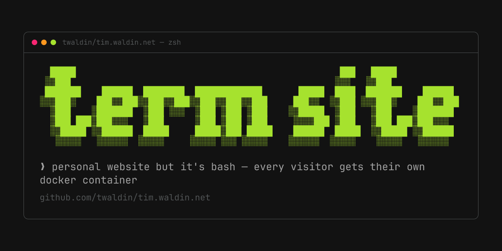

# Terminal Portfolio



My portfolio website that looks like a terminal. Users get an xterm.js terminal in their browser that connects to isolated Docker containers where they can run commands, explore my projects, view my resume, etc.

Live at [tim.waldin.net](https://tim.waldin.net)

## Architecture

```
Browser (xterm.js) → Nginx (reverse proxy, SSL, rate limiting)
                        ├── Next.js frontend (port 3000)
                        └── Node.js backend (port 3001)
                              ↕ Socket.IO
                              ↕ Docker Socket Proxy (port 2375)
                              └── Isolated Ubuntu container per user
```

## Tech Stack

- **Frontend**: Next.js 15, React 19, xterm.js 5.5 (fit, web-links, webgl addons), Socket.IO client
- **Backend**: Node.js 24, Express 5, Socket.IO 4, dockerode 4
- **Container**: Ubuntu 24.04, zsh, Oh My Posh, nightly neovim, figlet
- **Infrastructure**: Docker Compose, Nginx, Let's Encrypt SSL, Tecnativa docker-socket-proxy, Playwright e2e on GitHub Actions
- **Theme**: 463 Ghostty color schemes; defaults to iTerm2 Tango Dark or Light following `prefers-color-scheme`; JetBrainsMono Nerd Font

## Project Structure

```
term-site/
├── frontend/                  # Next.js app
│   ├── src/app/               # Routes: terminal page for / and every command URL, blog/, gui/, repo-card/, OG image, sitemap
│   ├── src/components/        # Terminal.tsx (xterm.js, OSC handlers, font sizing, clipboard)
│   ├── src/config/            # themes.ts (theme table + defaults), terminal-theme.ts (typography)
│   ├── src/lib/               # websocket.ts (URL → command, session id), theme-manager.ts, xterm-touch.ts
│   ├── content/               # gui.md
│   └── public/                # Fonts, resume.pdf, blog snapshots
├── backend/                   # Node.js session control plane
│   ├── server.js              # Express + Socket.IO wiring, audit log, /pv beacon, /admin
│   ├── session.js             # Per-connection timers, initCommand auto-typing, resize gate
│   ├── admission.js           # Leases: one session per IP, capacity cap, rate limit, reconnect grace
│   ├── lifecycle.js           # dockerode adapter, warm pool, attach/rebind
│   ├── sandbox-policy.js      # The container spec (limits, capabilities, network)
│   ├── admin.js, pageviews.js, logger.js
│   ├── proxy-validator/       # Body-validating Docker proxy: built and unit-tested, not in the data path
│   └── test/                  # Unit tests
├── container/                 # The Ubuntu image every visitor gets
│   ├── Dockerfile             # Tools, dotfiles, pre-cloned repos, aliases, zsh preexec URL sync
│   ├── scripts/               # scripts/*.sh — one per portfolio page
│   │   ├── shared-functions.sh, boot.sh, help.sh, theme.sh, blog.sh
│   │   └── animations/        # Boot intro animations
│   ├── blog/posts/            # Markdown posts
│   └── fonts/                 # figlet font pool for the banner
├── e2e/                       # Playwright suite (run by .github/workflows/e2e.yml)
├── scripts/                   # Ops scripts: deploy, VPS, blog, repo cards, fonts, themes
├── docker-compose.yml         # nginx, frontend, backend, socket-proxy
├── nginx.conf                 # Reverse proxy, SSL, rate limiting
└── deploy.sh                  # Build images, then swap the stack
```

## Development

Development happens on the production host; the local Docker Compose stack is retired. Production still uses `docker-compose.yml` and `nginx.conf`. This is a live environment, not a disposable development stack.

From a checkout with SSH access:

```bash
bash scripts/vps-ssh.sh
```

The helper connects through `root@tim.waldin.net`, opens a shell as `deploy`, and changes to `/home/deploy/term-site`. These defaults come from `scripts/lib/common.sh` (`VPS`, `DEPLOY_USER`, `DEPLOY_PATH`). Work in that checkout; inspect the running services without restarting them:

```bash
docker compose ps
docker compose logs --tail=50 frontend backend nginx
```

The running site is [https://tim.waldin.net](https://tim.waldin.net), not a localhost preview. Source edits do not update the running service images. Publishing a runtime change is a separate, explicitly scoped production operation: the root `deploy.sh` builds images, swaps the stack, prunes build cache, and installs renewal hooks. Do not run it just to start development or apply a documentation/script cleanup.

Native package commands remain available for isolated work: `cd frontend && pnpm dev` and `cd backend && npm start`. They are not a replacement production startup procedure. The backend needs a Docker daemon and the sandbox image; do not point a second backend at the production daemon, where it could interfere with live session containers. See [the frontend guide](frontend/CLAUDE.md#dev--build--tests) for native blog setup. Package tests are `cd frontend && pnpm test` and `cd backend && npm test`; backend unit tests need no Docker daemon.

## Security

Each visitor gets an isolated Docker container with:
- 512 MB RAM limit, 0.5 CPU limit, 100 process limit, 100 MB `noexec,nosuid` tmpfs on `/tmp`
- No network access (`NetworkMode: none`)
- Non-root `portfolio` user; all capabilities dropped, then only `SETUID` and `SETGID` added back for the `sudo` demo
- Docker Socket Proxy restricts the backend's API access to containers, images, POST, info, and ping (no networks, volumes, build, exec)

Session limits (`backend/session.js`, `backend/admission.js`):
- Pre-warmed pool of 5 containers; hard cap of 40 concurrent sessions
- One live session per IP: a new connection from the same IP replaces the old one; at most 30 connections per IP per minute
- Idle kill after 5 minutes without a keystroke
- Bot kill: a session that never receives input is freed after 60 s, relaxed to 5 minutes while the page reports itself visible
- 30-second reconnect grace after a disconnect; a refresh within it resumes the same container (same IP only)
- Nginx: 10 requests/s per IP (burst 20) for dynamic/backend routes; `/_next/static/` and `/fonts/` share a separate 100 requests/s budget (burst 200). The 10 concurrent connections per IP limit applies to both.

Users can run destructive commands like `rm -rf /` or fork bombs - they only affect their own container, not the host.

## Terminal Commands

Custom portfolio navigation:
- `about` - Learn about me
- `contact` - Email and social links
- `resume` - View my resume
- `projects` - Explore all projects
- `blog` - Posts I've written; `blog <slug>` opens a post
- `<project>` - Jump straight to a project page: `harness`, `hone`, `flt`, `agentelo`, `term-site`, `trade-up-bot`, `studyspot`, `stm32-games`, `dotfiles`, `tetrio-tui`, `deck`, `hone-a-drone`, `gepa-ts`, `also`
- `theme` - Re-theme the site with a live fzf preview over 463 schemes; `theme <name>`, `theme dark|light`, `theme reset`
- `boot` - Replay the intro animation; `boot <name>` picks one
- `gui` - The point-and-click version, for mouse users
- `help` - Show available commands
- `home` / `welcome` - Back to the main page (same as `boot`)

Plus tools for exploring the sandbox: `ls`, `cd`, `cat`, `nvim` (also `vi`/`vim`), `git`, `grep`, `rg`, `fzf`, `tree`, and `htop`. Bash and zsh share the portfolio aliases; zsh is the default and provides browser URL synchronization.

## Features

- Landing on `/` plays a boot intro: one of five random animations with a random figlet banner font sized to the terminal width, then the `welcome` page types out; any key skips it, and it replays on refresh
- Navigation commands sync with the browser URL: typing `about` moves the URL to `/about` (zsh `preexec` emits OSC 9999), and opening `/about`, `/projects/<name>`, or `/blog/<slug>` runs the matching command on connect
- Theme switcher with live preview, saved separately for dark and light mode
- Font size derived from viewport width (10–28 px) so ASCII art fits on any screen; touch scrolling with momentum on mobile
- Refresh resumes the same container within the reconnect grace
- Clickable hyperlinks via OSC 8 protocol
- Blog posts written in Markdown, listed by `blog` in the terminal and rendered as HTML pages at `/blog`
- `gui` hands off to a point-and-click page for mouse users
- Pre-cloned git repos with recent-commit display on project pages
- Oh My Posh shell prompt with Nerd Font icons
- Copy/paste (Ctrl/Cmd+C, Ctrl/Cmd+V), tab completion
- Social preview cards per repository (`/repo-card/<name>`) and per blog post
